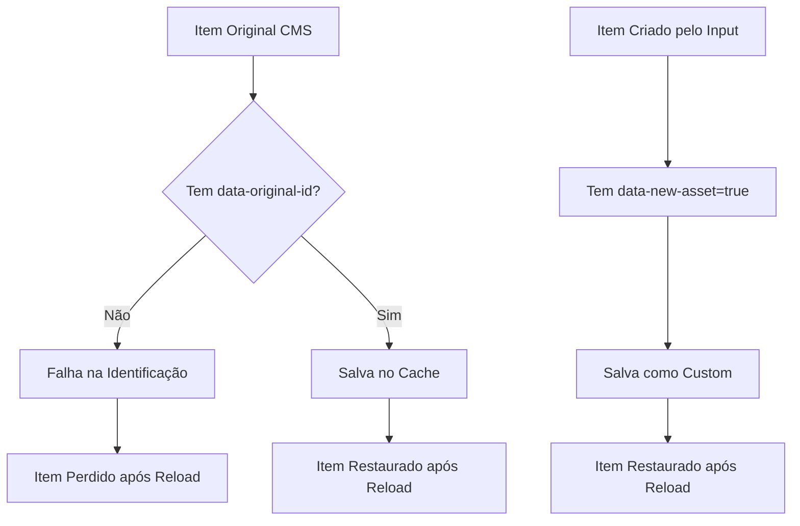

# Investigação: Problema de Cache com Itens Originais vs Criados

## 📋 Resumo Executivo

**Problema**: Apenas itens criados pelo input são salvos em cache quando arrastados para a área de drop, mas itens originais da lista não são persistidos corretamente.

**Impacto**: Usuários perdem itens originais arrastados após recarregar a página, causando má experiência de usuário.

**Causa Raiz**: Inconsistência na lógica de identificação e persistência entre itens originais (CMS) e itens criados dinamicamente.

## 🔍 Análise Detalhada

### Comportamento Atual

#### ✅ Itens Criados pelo Input (FUNCIONAM)

- Têm `data-new-asset="true"` desde a criação
- São identificados como `type: 'custom'` na persistência
- Têm `data-asset-name` com o nome do ativo
- São salvos e carregados corretamente do localStorage
- Chave de storage: `ativos_custom_assets`

#### ❌ Itens Originais da Lista (NÃO FUNCIONAM)

- Não têm `data-new-asset` (são identificados como `type: 'original'`)
- Dependem de `originalId` que pode não existir ou ser inconsistente
- A lógica de identificação falha na persistência
- Chave de storage: `ativos_drop_area_items`

### Fluxo de Dados Problemático



## 🐛 Problemas Identificados

### 1. Lógica de Identificação Inconsistente

**Arquivo**: `src/ativos/drop-area-persistence.ts` (linha ~45)

```typescript
const originalId =
  element.getAttribute('data-original-id') ||
  element.getAttribute('data-id') ||
  element.getAttribute('data-ativo-item');
```

**Problema**: Itens originais do Webflow CMS podem não ter esses atributos inicialmente.

### 2. Atribuição de ID Tardia

**Arquivo**: `src/ativos/enhanced-sortable-manager.ts` (método `handleAdd()`)

```typescript
// Add identification attributes if missing for original items
if (
  !element.getAttribute('data-original-id') &&
  !element.getAttribute('data-id') &&
  !element.hasAttribute('data-new-asset')
) {
  const uniqueId = `original-${itemName.toLowerCase().replace(/\s+/g, '-')}-${Date.now()}`;
  element.setAttribute('data-original-id', uniqueId);
  element.setAttribute('data-ativo-item', 'true');
}
```

**Problema**: A atribuição de ID só acontece quando o item é movido, mas pode falhar se o elemento não for processado corretamente.

### 3. Falha na Função `hideSourceItem()`

**Arquivo**: `src/ativos/drop-area-persistence.ts` (método `hideSourceItem()`)

```typescript
private static hideSourceItem(originalId: string, itemName: string): void {
  // Match by ID or name
  if ((originalId && elementId === originalId) || (!originalId && elementName === itemName)) {
    element.style.display = 'none';
    element.setAttribute('data-original-hidden', 'true');
  }
}
```

**Problema**: Se `originalId` for `null` ou `undefined`, a lógica de fallback por nome pode não funcionar adequadamente.

### 4. Inconsistência entre Sistemas de Storage

- **Itens Custom**: Salvos em `ativos_custom_assets` (apenas metadados)
- **Itens Drop Area**: Salvos em `ativos_drop_area_items` (estado completo)
- **Problema**: Dois sistemas diferentes para tipos diferentes de itens

## 🎯 Objetivos da Correção

1. **Garantir identificação única** para todos os itens originais desde a inicialização
2. **Unificar a lógica de persistência** entre itens originais e criados
3. **Melhorar a robustez** da função de ocultação de itens fonte
4. **Adicionar fallbacks** para casos onde a identificação falha
5. **Manter compatibilidade** com o sistema atual

## 📊 Impacto Esperado

### Antes da Correção

- ❌ Itens originais perdidos após reload
- ❌ Experiência inconsistente do usuário
- ❌ Necessidade de recriar seleções

### Após a Correção

- ✅ Todos os itens persistidos corretamente
- ✅ Experiência consistente
- ✅ Estado da aplicação mantido entre sessões

## 🔧 Estratégia de Implementação

### Fase 1: Identificação Precoce

- Atribuir IDs únicos durante a inicialização
- Garantir que todos os itens tenham identificação adequada

### Fase 2: Unificação da Persistência

- Melhorar a lógica de salvamento
- Adicionar fallbacks robustos

### Fase 3: Fortalecimento da Restauração

- Melhorar a função de ocultação
- Adicionar logs de debug

### Fase 4: Testes e Validação

- Testar com diferentes tipos de itens
- Validar persistência entre sessões

## 📝 Arquivos Afetados

1. `src/ativos/enhanced-sortable-manager.ts`
2. `src/ativos/drop-area-persistence.ts`
3. `src/ativos/sortable-manager.ts` (se necessário)
4. `tests/ativos-drag-drop.spec.ts` (atualizar testes)

## 🚀 Próximos Passos

1. Criar especificação detalhada das correções
2. Implementar as mudanças seguindo a especificação
3. Executar testes para validar as correções
4. Documentar as mudanças realizadas

---

**Data da Investigação**: 21/01/2025  
**Investigador**: Kiro AI Assistant  
**Status**: Investigação Completa - Pronto para Implementação
